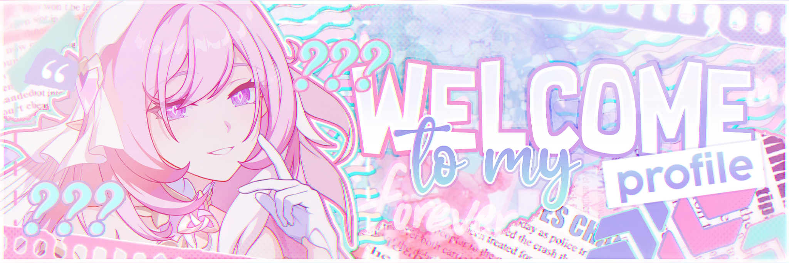

    
    <h2 align="center"> Hello!👋 I'm Nino! Nice to meet you! ✨</h2>
    </a>

## 🌠 About me 
<table style="width:100%; text-align:center;">
  <tr>
    <td style="width:50%;"></td>
    <td style="width:50%;">
      <h2>Tokisaki Nino</h2>
        
🍀 A programmer, software architect. Likes watching anime, listening to music and playing games (Open World, ARPG Games).

        
🍀 My version: 18.3.

        
🍀Personality: He, Him, She, Her - Unknown.

      
💖“Did you want to see me? Your Elysia will always meet your expectations. ♪.” – Elysia

    </td>
  </tr>
</table>

## ✨ Facts 
My favorite quote: "What kind of person do you expect me to be? Normal partner? Self-training subjects? A social acquaintance... or... an important teammate? Based on your attitude and expectations, I will "play" or "become" one of them." - Yelan - Genshin Impact.

## 🔬 Experience 
I have experience in parts related to PHP, Vuejs, Nodejs,...

## 📞 Contact

    
    
    
    
    

## 🤖 Github summary 

## 🍀 Github Commits
<picture>
  <source media="(prefers-color-scheme: dark)" srcset="https://github.com/TokisakiNinoVn/TokisakiNinoVn/blob/output/github-contribution-grid-snake-dark.svg">
  <source media="(prefers-color-scheme: light)" srcset="https://github.com/TokisakiNinoVn/TokisakiNinoVn/blob/output/github-contribution-grid-snake.svg">
  
</picture>

## 💖💖💖 Elysia 💖💖💖

    <a href="https://github.com/TokisakiNinoVn">
    <a href="https://github.com/marketplace/actions/update-image-readme">
    <!--START_SECTION:update_image-->

<!--END_SECTION:update_image-->
    </a>
    <!-- -->
    </a>

##
`If you have any questions or simply want to talk about your day, I'm always ready to hear from you. I'm always here, waiting for you!🍀🍀🍀`
